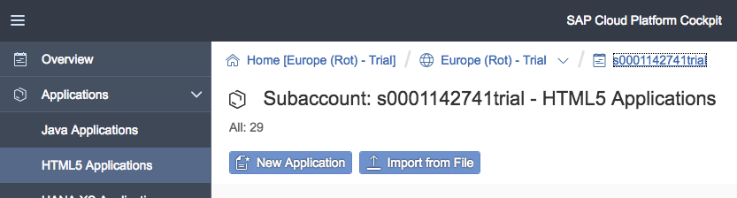
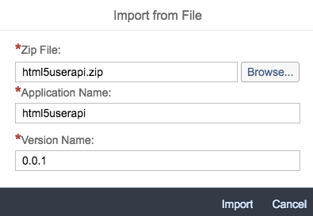
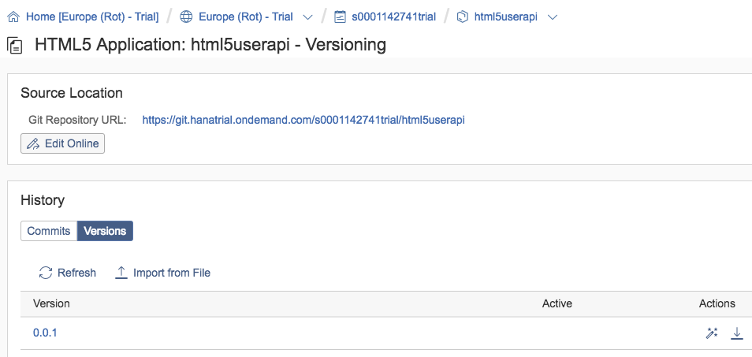
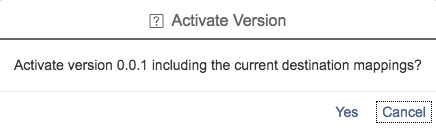
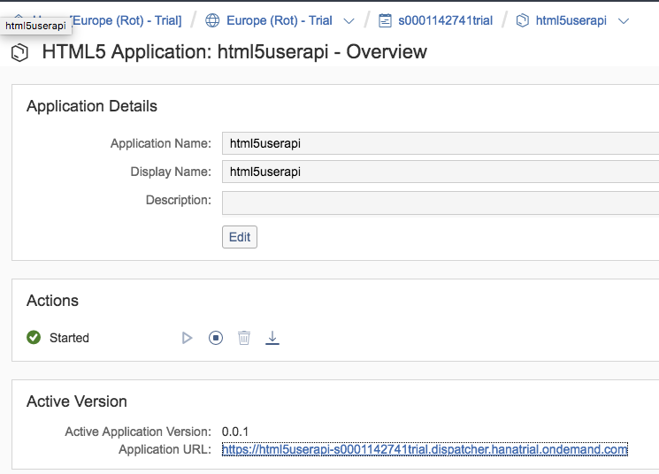
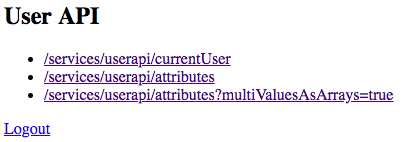
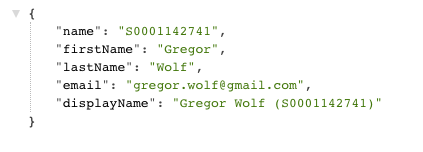

# HTML5UserAPI
This project provides a simple HTML5 webpage with links to all endpoints of the [SAP Cloud Platform User API](https://help.sap.com/viewer/65de2977205c403bbc107264b8eccf4b/Cloud/en-US/1de599bf722446849d2b2e10132df42a.html). It can be deployed as a HTML5 app to the SAP Cloud Platform.

## Deployment
### TL;DR
* Clone in SAP Web IDE and deploy to SCP
* Download [html5userapi.zip](html5userapi.zip?raw=true), upload via **Import from File** in HTML5 Applications, navigate to Versioning -> Versions and activate

##Detailed Description for the upload
Download [html5userapi.zip](html5userapi.zip?raw=true) and then open Applications -> HTML5 Applications and click on **Import from File**

Choose the file **html5userapi.zip** you've just downloaded and fille the form as shown below

Navigate to the just uploaded HTML5 App and go to Versioning --> Version. Click the **Activate** icon there

Confirm the pop-up with **Yes**

Now you can open the app by clicking the Application URL

You should see a list of this links

When you click on **/services/userapi/attributes?multiValuesAsArrays=true** you should see

This endpoint will show you also Group assignments done in a custom IdP.